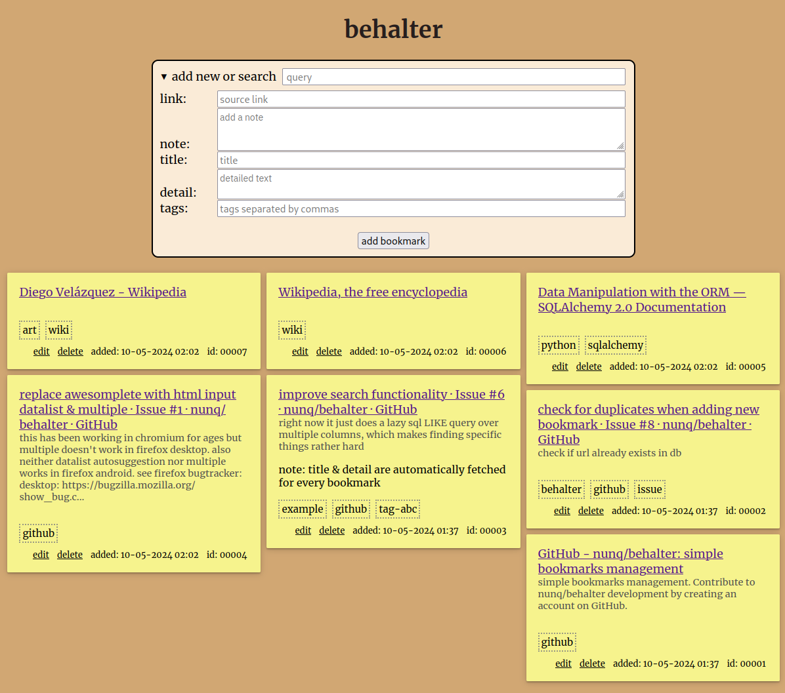

# behalter

simple bookmarks management

## features
* auto-fetches title and detail for url
* add personal note to each bookmark
* tagging, with auto-suggestions
* search by query
* search by tag (using 'tag:...' in the search bar)
* search by id (using 'id:...' in the search bar)
* duplicate detection
* edit & delete bookmarks
* displays favicons next to bookmarks
* adding bookmarks using inoreader's webhook feature (see below)
* uses just an sqlite database

### adding by inoreader webhook
create an inoreader rule that makes a POST request to the following endpoint:
```txt
https://<your-behalter-instance>.tld/<changeme-prefix>/webhook/add?auth=<changeme-secret-token>
```

## setup
* customize the http basic auth settings in behalter.nix
* add the contents of behalter.nix to your nix os configs
* cp the files in this repo to `/var/lib/behalter/`
* `sudo chown -R uwsgi:uwsgi /var/lib/behalter/`
* rebuild nix os
* restart uwsgi

### sample `config.json` file
to be placed in `instace/config.json`

```json
{
  "SQLALCHEMY_DATABASE_URI": "sqlite:///bm.db",
  "WEBHOOK_PREFIX": "<changeme-prefix>",
  "WEBHOOK_TOKEN": "<changeme-secret-token>"
}
```

## screenshot
the colorscheme is supposed to resemble a pinboard with post-its. (the favicon display feature is missing in the screenshot because it's an old version).



## notes
the site itself uses an [experimental new css setting](https://developer.mozilla.org/en-US/docs/Web/CSS/CSS_Grid_Layout/Masonry_Layout) to automatically show the bookmarks as cards side by side.

as of now it's only implemented in firefox and hidden behind a flag, see [caniuse](https://caniuse.com/mdn-css_properties_grid-template-rows_masonry)

in firefox' about:config set `layout.css.grid-template-masonry-value.enabled` to `true`
